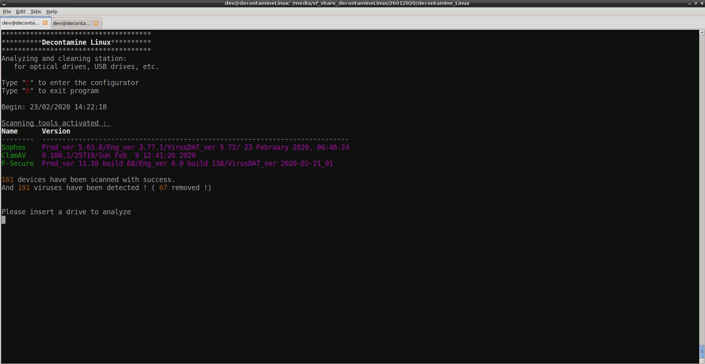
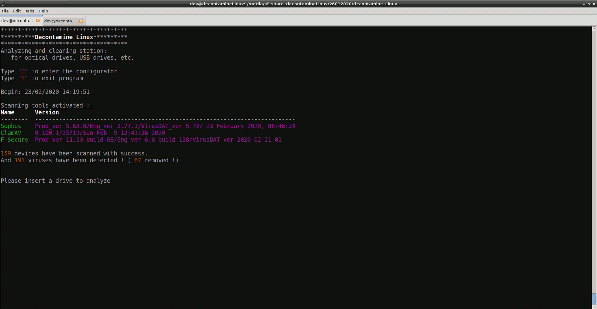
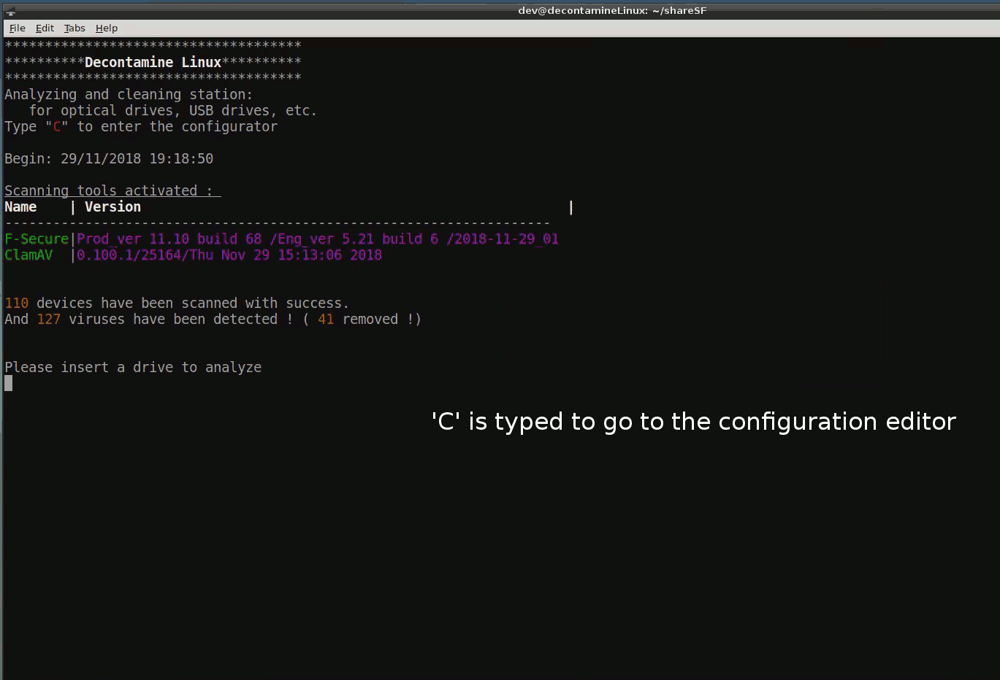

# Decontamine_Linux
[](https://www.gnu.org/licenses/agpl-3.0.en.html)
[](https://www.linux.com/)
[](https://www.python.org/)

Decontamine_Linux is an USB devices cleaning station for Linux.  
Started since September 2018.  
Coding and testing on ***Debian 9*** 64 bits with Python 3.  
Project ongoing.  

## Getting Started
Download the project on your computer.
```
git clone https://github.com/alevoski/decontamine_Linux.git
```

### Prerequisites
#### Create a user "decontamine" or a folder named "decontamine" in /home
Put the folder writing permission for anyone.
It's where  the logs files and the config file will be stored.
```
sudo chmod -R 757 /home/decontamine
```

#### Install the required pip modules
```
pip install -r requirements.txt
```
#### Install at least one of this antivirus:
***ClamAV***
```
apt-get update
apt-get install clamav
apt-get install clamav-daemon
```
***Sophos***  
Download it on [Sophos website](https://www.sophos.com/en-us/products/free-tools/sophos-antivirus-for-linux.aspx)  
Install it without live protection  
```
tar -xzvf sav-linux-free-9.tgz
sudo ./sophos-av/install.sh --live-protection=false
```
***F-Secure***  
Download it on [F-Secure website](https://www.f-secure.com/en/web/business_global/downloads/linux-security)  
Install all dependencies based on [Pre installation checklist](https://community.f-secure.com/t5/Business/Pre-installation-checklist-for-F/ta-p/76128)  
```
sudo dpkg --add-architecture i386
sudo apt-get update
sudo apt-get install libpam-modules:i386 libstdc++6:i386 perl rpm zlib1g:i386
```
Install it with Command Line Scanner Only  
```
tar -xzvf fsls-11.10.68-rtm.tar.gz
sudo ./fsls-11.10.68-rtm/fsls-11.10.68 --command-line-only
```

### HOW TO USE ?
```
cd CS/
python3 main.py
```

#### Demos  
*** Classical USB thumb key scanning ***  
  

*** Optical drive scanning ***  
  

*** Multiple devices USB hard drive scanning***  
  

*** Configuration editor ***  
  

## Documentation
For more information, please read the [documentation](https://github.com/alevoski/decontamine_Linux/tree/master/DOCS) in DOCS/ directory

## Author
Alexandre Buissé

## License
Decontamine_Linux. USB devices cleaning station.  
Copyright (C) 2018 Alexandre Buissé alevoski@pm.me

This program is free software: you can redistribute it and/or modify  
it under the terms of the GNU Affero General Public License as published  
by the Free Software Foundation, either version 3 of the License, or  
(at your option) any later version.  

This program is distributed in the hope that it will be useful,  
but WITHOUT ANY WARRANTY; without even the implied warranty of  
MERCHANTABILITY or FITNESS FOR A PARTICULAR PURPOSE.  See the  
GNU Affero General Public License for more details.  

You should have received a copy of the GNU Affero General Public License  
along with this program.  If not, see <https://www.gnu.org/licenses/>.


